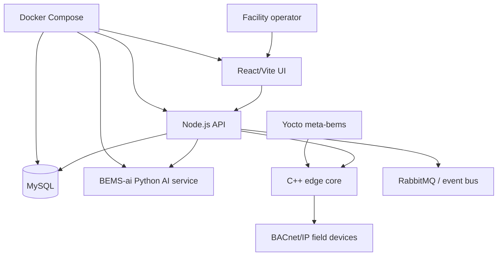
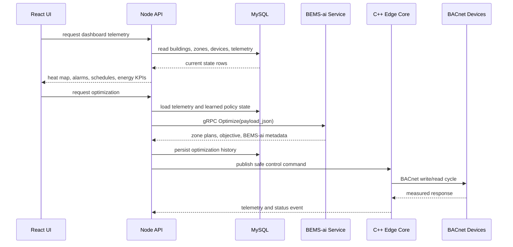
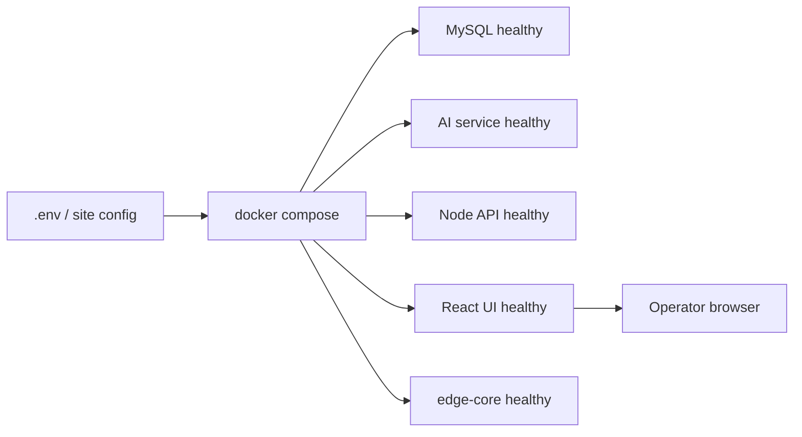

# BEMS Deep Architecture

## Purpose

The BEMS project models an enterprise building energy management platform that
connects operator dashboards, REST APIs, MySQL data, BEMS-ai optimization,
embedded C++ edge services, BACnet-oriented device control, Docker deployment,
and Yocto packaging.

This document is a deep architecture companion to `docs/architecture.md`. It
focuses on integration contracts, runtime data flow, and how the repository
maps to deployment evidence.

## System Context



## Repository Layers

```text
BEMS_ENTERPRISE_COMPLETE/repo/
├── ui/                 React/Vite operator dashboard
├── node-api/           Express API, auth, MySQL, AI gRPC, edge bridge
├── ai-service/         Python BEMS-ai optimization service boundary
├── edge-core/          C++ edge service and BACnet-oriented runtime
├── field-device/       Field device firmware/service area
├── database/schema.sql MySQL schema and seedable entity model
├── proto/              gRPC service contract
├── docker/             Compose stack and service health model
├── yocto/              Embedded Linux packaging notes
└── docs/               Architecture, backend, API, database, deployment docs
```

## Runtime Data Flow



## Service Responsibilities

### React/Vite UI

The UI is the operator-facing layer. It should emphasize:

- telemetry scanning
- BEMS heat maps
- usage and cost trends
- alarms and schedules
- device state
- optimization recommendations
- service readiness

It should remain a client of the Node API, not a direct database or BACnet
client.

### Node API

The Node API is the system coordinator:

- session and role handling
- REST endpoints for UI workflows
- MySQL query and persistence boundary
- BEMS-ai gRPC client
- edge command client
- digital twin and schedule endpoint composition
- alarm and audit event shaping

The API owns safety checks before any optimization recommendation can become a
field command.

### MySQL

MySQL stores the operational state:

- users and roles
- buildings, zones, devices
- telemetry samples
- alarms
- schedules
- optimization history
- learned RL policy state

The schema is the source for ERD and entity screenshots.

### BEMS-ai Service

The Python AI service is the optimization layer. It exposes:

- HTTP health and fallback endpoints
- gRPC `AiOptimizationService`
- whole-building optimization
- policy feedback updates
- physics or digital-twin simulation hooks
- demand response planning

The project direction is for this service to consume BEMS-ai modules for state
layout, simulation, digital twin, and grid-aware optimization.

### Edge Core

The C++ edge core is the boundary to site equipment. It should:

- poll field protocols such as BACnet/IP
- normalize device telemetry
- publish state upward
- receive vetted control commands
- enforce local safety and maintenance lockouts
- keep operating when cloud/UI components are unavailable

### Docker and Yocto

Docker Compose provides local and site-server deployment. Yocto supports
embedded Linux packaging for the edge layer.

## API and Contract Boundaries

| Boundary | Contract |
| --- | --- |
| UI to API | HTTP/JSON and SSE where applicable |
| API to MySQL | SQL schema in `database/schema.sql` |
| API to AI | gRPC proto in `proto/ai_service.proto` |
| API to Edge | edge command/event client contract |
| Edge to field devices | BACnet-oriented device access |
| Docker health | service health checks and dependency conditions |

## Dashboard Evidence Alignment

Portfolio/dashboard evidence should map to these files:

| Evidence | Source |
| --- | --- |
| real React dashboard screenshot | `ui/` running against seeded MySQL |
| BEMS energy heat map | telemetry or sample data in MySQL |
| API health response | Node API health endpoint |
| AI health response | `ai-service` `/health` and gRPC health |
| digital twin response | API endpoint backed by AI or deterministic simulation |
| alarm and schedule responses | API endpoints and seeded schema data |
| ERD/schema screenshot | `database/schema.sql` |
| deployment health screenshot | Docker service status |

## Deployment Flow



## Architecture Decisions

| Decision | Current Choice | Reason |
| --- | --- | --- |
| UI framework | React/Vite | Fast operator dashboard development |
| Backend | Node.js/Express | REST API, auth, MySQL, and gRPC coordination |
| Database | MySQL | Structured building, telemetry, alarm, and schedule data |
| AI contract | Python service over gRPC | Keeps BEMS-ai runtime isolated from the API server |
| Edge layer | C++ | Fits embedded/BACnet-oriented runtime constraints |
| Deployment | Docker plus Yocto | Covers local stack and embedded Linux target paths |
| Documentation | Markdown plus UML PNGs | Supports portfolio, engineering review, and deployment evidence |

