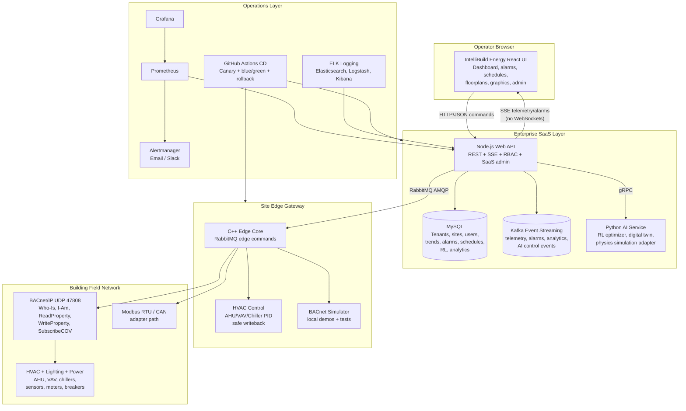

# IntelliBuild Energy Product Overview

**From edge to cloud, smarter buildings.**

## Executive Summary

IntelliBuild Energy is an installable, multi-tenant smart-building platform for commercial BMS/BEMS operation. It combines a React operator UI, Node.js SaaS API, MySQL persistence, Python AI optimization, C++ edge control, BACnet/IP device integration, Kafka event streaming, and Ubuntu 22.04 container deployment.

The target product category is a commercial-grade BEMS comparable in scope to Siemens Desigo CC, Schneider EcoStruxure, Honeywell/Johnson Controls supervisory platforms, and Niagara-style building automation frameworks, with added edge AI and SaaS deployment patterns.

## What The System Provides

- Multi-tenant SaaS model for organizations, sites, buildings, users, roles, sessions, audit events, and feature flags.
- Real building integration aligned to ANSI/ASHRAE Standard 135-2020 through BACnet/IP Who-Is/I-Am discovery, ReadProperty, WriteProperty, SubscribeCOV setup, safe writeback, and simulator-backed commissioning.
- Production BACnet stack path through the SourceForge BACnet Protocol Stack at `https://sourceforge.net/projects/bacnet/`, integrated behind the C++ edge-core BACnet interface.
- Edge gateway operation for each building/site, including offline-safe local control and BACnet communication.
- Node.js Web API for REST commands, RabbitMQ edge orchestration, SSE browser live updates, remote management, watchdog health, and administration.
- Python AI service for whole-building optimization, reinforcement learning, predictive simulation, and digital-twin upgrade paths.
- C++ edge core with modular BACnet, BACnet server/device object database, writeback, fieldbus, AHU/VAV/chiller PID control strategies, and RabbitMQ command orchestration.
- Buildable C++ bare-metal BACnet field-device firmware target with SOLID interfaces, simulator drivers, persistent storage, device-resident schedules, signed SWUpdate OTA bootloader flow, optional system package updates, watchdog, and control strategy tests.
- Reporting center with scheduled reports, manual and due-run execution, notification outbox delivery records, filtered PDF/CSV/JSON exports, role-based report permissions, export audit history, and zone heat map.
- React production UI direction modeled after commercial WebStation/SCADA workflows: command center, equipment graphics, floorplans, schedules, alarms, trend charts, digital twin, device provisioning, and admin.
- Observability stack with health checks, Prometheus metrics, Grafana dashboards, Alertmanager email/Slack hooks, Watchtower auto-updates, and optional ELK logging.
- CI/CD with container image builds, canary deployment scripts, multi-region deployment hooks, zero-downtime promotion/rollback, backups, and disaster recovery scripts.
- Production physical board flashing and update-cycle validation runbook for Yocto image flashing, SWUpdate install, rollback, system package updates, RabbitMQ OTA command delivery, BACnet smoke tests, and nRF52840 checks.
- Architecture implementation diff and traceability record showing the completed design against `docs/architecture.md`.
- Richer commissioning tools with readiness scoring, per-device acceptance evidence, protocol smoke checks, trend/alarm verification, and audit records.
- Broader protocol coverage for BACnet, Modbus, CAN, KNX/IP, DALI-2, LonWorks, OPC UA, SNMP, REST, and MQTT adapter contracts.
- Long-run field hardening profiles for 24-hour commissioning, 7-day site acceptance, and 30-day warranty burn-in soak testing.
- Commercial readiness workflows for field deployment evidence, vendor gateway testing, cybersecurity review, operator handover, and engineering handover.

## Core Modules

These are the sellable product modules.

| Module | Customer Value | Implemented Surfaces |
| --- | --- | --- |
| Monitoring | Real-time HVAC, energy, alarms, trends, and device state visibility | React dashboard, SSE telemetry/alarm streams, trend logs, energy KPI cards, cost/carbon footprint API |
| Control | BACnet command writes with safety checks and operator approval | RabbitMQ edge commands, BACnet WriteProperty, safe writeback rollback, setpoint/range APIs, maintenance lockout |
| Scheduling | Occupancy and exception-based building operation | Daily/monthly/yearly schedules, building/zone/device overrides, holiday schedules, special events |
| AI Optimization | Comfort, energy, cost, and peak-demand optimization | Python AI optimizer, RL Q-values, predictive simulation, Smart Grid AI, demand response adapter |
| Fault Detection | Detect abnormal operation and generate service workflow | FDD findings, alarm creation, maintenance tickets, stuck valve/fan/off-hours/simultaneous heat-cool checks |
| Enterprise SaaS | Multi-site commercial operation | Organizations, sites, RBAC, user admin, audit events, feature flags, remote management |

## Use Cases

| Use Case | IntelliBuild Energy Value |
| --- | --- |
| Commercial buildings | Reduce energy cost, monitor HVAC and power, automate schedules, and give operators a modern dashboard. |
| Hospitals | Improve reliability, alarm visibility, uptime monitoring, audit history, and comfort protection for critical spaces. |
| Schools | Lower utility bills, simplify holiday/academic schedules, manage multiple buildings, and reduce after-hours waste. |
| Smart cities | Scale multi-site energy monitoring, standardize edge gateways, support demand response, and centralize analytics. |
| Residential | Enable smart multi-family or premium residential energy monitoring, comfort automation, and remote service visibility. |

## Final UI Features

- Dark/light mode toggle.
- Professional sidebar navigation: Home, Buildings, Alarms, Trends, Graphics, Settings.
- Grid dashboards with KPIs, charts, telemetry cards, and energy/cost/carbon panels.
- Drag-and-drop graphics/floorplan editor.
- AHU/VAV equipment graphics.
- Alarm severity color overrides.
- Real-time data cards through SSE.
- Responsive design for desktop and tablet-sized operation screens.

## Publish-Ready Architecture Diagram



## Production UI Direction

The UI is designed as an operator command center rather than a marketing site:

- Home Page dashboard is the default landing view for KPIs, telemetry, AI status, alarms, energy cost, carbon, charts, and schedules.
- Left-to-right operational flow: site context, live KPIs, alarm state, equipment graphics, trends, floorplan, schedules, and administration.
- BMS-style system tree and graphics views for building/floor/room/zone/device navigation.
- AHU/VAV graphics with fan, coil, valve, damper, temperatures, airflow animation hooks, and alarm color override.
- Dark mode for control-room use.
- Role-based menus for admin, operator, and viewer workflows.
- Live updates through SSE streams only. WebSockets are intentionally excluded.

## Installable Product Packaging

Recommended product packages:

- **Site Gateway Package**: C++ edge core, BACnet simulator option, fieldbus adapters, systemd unit, Yocto/i.MX93 integration, local watchdog.
- **Enterprise Server Package**: Node API, React UI served by Apache, MySQL, Python AI service, Kafka, Prometheus/Grafana, Alertmanager.
- **Observability Package**: optional ELK profile plus Prometheus/Grafana dashboards and alert rules.
- **Cloud Deployment Package**: GitHub Actions workflow, GHCR images, canary scripts, backup/restore scripts, multi-region blue/green hooks.

Local install command:

```bash
cd repo/docker
docker compose up --build -d
```

With observability logging:

```bash
cd repo/docker
docker compose --profile observability up --build -d
```

## Enterprise SaaS Model

Core SaaS concepts:

- **Organization**: tenant/customer account.
- **Site**: campus or facility under an organization.
- **Building**: physical building managed by the system.
- **Floor -> Room -> Zone -> Device -> Point**: logical UI/database hierarchy mapped to flat BACnet device/object structures.
- **Role**: admin, operator, viewer, or custom permission set.
- **Feature flag**: customer-configurable product modules such as FDD, BACnet auto-learn, AI control, and advanced reporting.

## AI And Control Capabilities

- Reinforcement learning Q-values persisted in MySQL.
- Whole-building optimization across zones rather than isolated device tuning.
- Predictive simulation before applying real controls.
- EnergyPlus integration path through configured model/weather/binary paths.
- AI-driven demand response with utility event adapter and safety policy.
- Smart Grid AI for price signals, demand risk, storage/renewable context, load shedding, and peak avoidance.
- BACnet Energy Services Interface and B/WS-style structured signal facade for external energy data clients.
- Fault detection for stuck valves, fan failures, temperature not reaching setpoint, simultaneous heating/cooling, and off-hours energy waste.
- C++ HVAC control strategies for AHU, VAV, and chiller PID loops.

## Monitoring, Logging, And High Availability

- `/api/health`, `/api/watchdog`, and `/metrics` endpoints.
- Prometheus scrape config and alert rules.
- Grafana dashboard provisioning.
- Alertmanager email/Slack placeholders.
- ELK logging profile with Logstash GELF input.
- Watchtower auto-update support for labeled containers.
- CI/CD canary deployment scripts for blue/green target groups.
- Multi-region primary/secondary deployment hooks.
- Backup and restore scripts for MySQL disaster recovery.

## Go-To-Market And Pricing Strategy

Target customer segments:

| Segment | Primary Value |
| --- | --- |
| Commercial buildings | Energy savings, comfort, lower operating cost, modern dashboards |
| Hospitals | Reliability, alarm visibility, uptime, compliance-friendly audit trails |
| Schools | Cost reduction, schedules, seasonal operation, multi-building simplicity |
| Smart cities | Scalability, multi-site supervision, energy reporting, edge gateway standardization |
| Residential | Comfort, remote monitoring, energy savings, smart home/building integration |
| Airports and campuses | High availability, centralized operations, fault detection, remote management |

Recommended packaging:

| Tier | Target Customer | Included Capabilities | Suggested Pricing Basis |
| --- | --- | --- | --- |
| Starter | Small commercial building | 1 building, basic monitoring, dashboards, alarms, schedules, BACnet simulator/edge gateway path | $99/month |
| Professional | Multi-building commercial site | Multiple buildings, AI optimization, analytics, trend logging, FDD, cost/carbon dashboards | $299/month |
| Enterprise | Hospitals, airports, campuses, smart-city deployments | Full digital twin, demand response, API access, multi-tenant RBAC, HA, observability, remote management, canary deployments | $999+/month |
| OEM / Integrator | Controls vendors and service firms | White-label UI, gateway image, deployment docs, API integration, support package | Platform license + support/SLA |

Hardware and installation pricing:

| Item | Price Range | Notes |
| --- | --- | --- |
| Edge gateway | $200-800 | i.MX93-class appliance, industrial gateway, or site server depending on building scale |
| Installation | $500-2000 | BACnet network setup, gateway mounting, commissioning, device discovery, dashboard validation |

Commercial positioning:

- Lower deployment complexity than traditional BMS supervisory stacks.
- Modern web UI, API-first integration, and containerized operations.
- Native edge AI gateway story for i.MX93-class embedded hardware.
- Differentiation through whole-building optimization, digital twin simulation, Kafka events, and SaaS administration.

## Current Readiness Snapshot

Ready now:

- Dockerized local system with API, UI, DB, AI service, edge core, simulator, Kafka, and observability components.
- Real BACnet/IP integration path in the C++ edge core with simulator support.
- Multi-tenant SaaS database and auth/RBAC surfaces.
- Live dashboard updates with SSE.
- AI control loop, RL persistence, FDD, trends, schedules, alarms, and device provisioning APIs.
- CI and CD workflow files and deployment scripts.

Next hardening steps:

- Connect EnergyPlus runner to real IDF/EPW files in deployment environments.
- Add production identity provider support such as SAML/OIDC.
- Add multi-node MySQL or managed database configuration.
- Add real OpenADR/utility API connector credentials and event ingestion.
- Validate BACnet COV behavior against target controller vendors.
- Complete BACnet PICS and certification testing before claiming formal Standard 135-2020 or BTL conformance.
